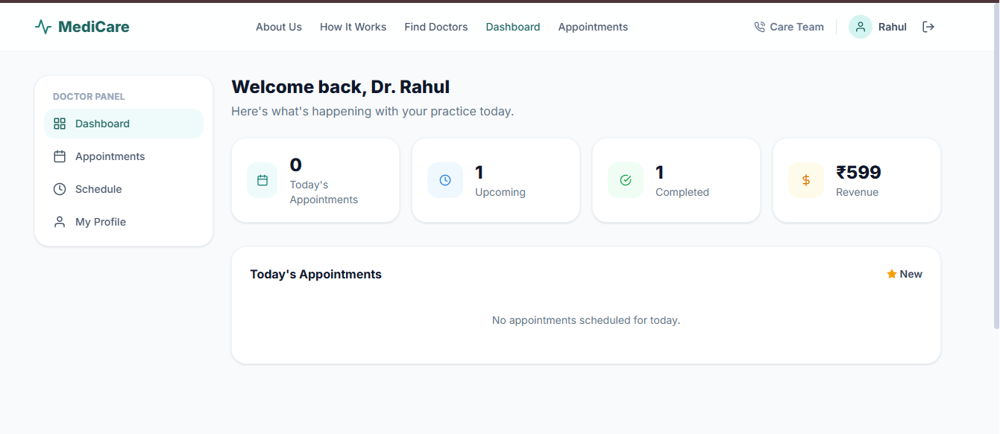
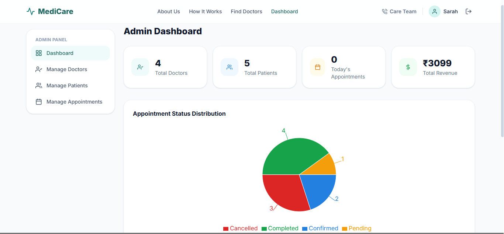

# 🩺 MediCare — Doctor Appointment System (MERN)

A full-stack healthcare appointment platform that enables patients to discover doctors, book appointments, and manage healthcare interactions seamlessly.

Built using the **MERN Stack (MongoDB, Express.js, React, Node.js)** with secure authentication, role-based access control, and dedicated dashboards for Patients, Doctors, and Admins.

---

## 🔗 Live Demo

🌐 Frontend: 

⚙️ Backend API: https://medicure-be.onrender.com

---

## 📸 Screenshots

### 🏠 Home Page


### 👨‍⚕️ Doctor Dashboard




### 🛡️ Admin Dashboard




---

## 🌟 Highlights

- Multi-role authentication (**Patient, Doctor, Admin**)
- JWT-based secure authentication
- Role-based access control (RBAC)
- Doctor appointment booking system
- Doctor slot management
- Appointment cancellation and rescheduling
- Admin dashboard with analytics and charts
- Responsive modern healthcare UI
- Protected frontend and backend routes
- RESTful API architecture

---

## ✨ Features

### 🔐 Authentication & Security

- JWT Authentication
- Password hashing with bcrypt
- Protected routes
- Role-based authorization (RBAC)
- Persistent login using localStorage
- Secure API access using JWT interceptors

---

### 👤 Patient Features

- Register/Login
- Browse all doctors
- Search doctors
- Filter doctors by specialization
- View doctor profiles
- Book appointments
- Cancel appointments
- Reschedule appointments
- View appointment history
- Manage profile

---

### 👨‍⚕️ Doctor Features

- Register/Login
- Complete professional profile
- Add qualifications and specialization
- Manage consultation fee
- Add and manage available slots
- Enable holiday mode
- Accept/Reject appointments
- Mark appointments as completed
- Dashboard with today's stats and revenue

---

### 🛡️ Admin Features

- Dashboard analytics
- View total doctors, patients, and appointments
- Approve/Deactivate doctors
- Block/Delete patients
- Manage all appointments
- Cancel appointments
- Appointment status distribution charts

---

## 🎨 Color Palette

| Role | Color | Hex |
|-------|-------|------|
| Primary | Teal | `#1f7f7a` |
| Secondary | Blue | `#237fe0` |
| Background | Light Gray | `#f8fafc` |
| Text | Dark Slate | `#0f172a` |
| Success | Green | `#16a34a` |
| Warning | Orange | `#d97706` |
| Danger | Red | `#dc2626` |
| Rating | Amber | `#f59e0b` |

Complete color scale available in:

```bash
frontend/tailwind.config.js
```

---

## 🛠️ Tech Stack

| Frontend | Backend | Database | Authentication |
|-----------|----------|-----------|----------------|
| React 18 | Node.js | MongoDB | JWT |
| Vite | Express.js | Mongoose | bcryptjs |
| Tailwind CSS | REST APIs | MongoDB Atlas | RBAC |
| React Router DOM | Express Middleware | | |
| Axios | | | |
| React Hook Form | | | |
| Context API | | | |
| Recharts | | | |

---

## 📁 Project Structure

```text
doctor-appointment-system/
│
├── backend/
│   ├── config/
│   │   └── db.js
│   │
│   ├── controllers/
│   │   ├── authController.js
│   │   ├── doctorController.js
│   │   ├── appointmentController.js
│   │   ├── adminController.js
│   │   └── doctorDashboardController.js
│   │
│   ├── middleware/
│   │   ├── authMiddleware.js
│   │   └── errorMiddleware.js
│   │
│   ├── models/
│   │   ├── User.js
│   │   ├── Doctor.js
│   │   ├── Patient.js
│   │   ├── Appointment.js
│   │   └── Review.js
│   │
│   ├── routes/
│   ├── utils/
│   ├── server.js
│   └── .env.example
│
└── frontend/
    ├── src/
    │   ├── components/
    │   ├── context/
    │   ├── layouts/
    │   ├── pages/
    │   ├── services/
    │   └── App.jsx
    │
    └── tailwind.config.js
```

---

## 🚀 Getting Started

### 1️⃣ Clone Repository

```bash
git clone https://github.com/yourusername/doctor-appointment-system.git

cd doctor-appointment-system
```

---

## ⚙️ Backend Setup

```bash
cd backend

npm install
```

Create a `.env` file:

```env
PORT=5000

MONGO_URI=your_mongodb_connection_string

JWT_SECRET=your_secret_key
```

Start backend server:

```bash
npm run dev
```

Backend runs on:

```bash
http://localhost:5000
```

---

### Create Admin Account

Admin registration is intentionally disabled.

Create an admin using:

```bash
node utils/seedAdmin.js
```

Default credentials:

```text
Email: admin@medicare.com
Password: Admin@123
```

---

## 💻 Frontend Setup

```bash
cd frontend

npm install

npm run dev
```

Frontend runs on:

```bash
http://localhost:5173
```

---

## 🔑 API Overview

| Method | Endpoint | Access |
|---------|-----------|---------|
| POST | `/api/auth/register` | Public |
| POST | `/api/auth/login` | Public |
| GET | `/api/auth/profile` | Private |
| PUT | `/api/auth/profile` | Private |
| GET | `/api/doctors` | Public |
| GET | `/api/doctors/:id` | Public |
| PUT | `/api/doctors/profile` | Doctor |
| POST | `/api/doctors/slot` | Doctor |
| DELETE | `/api/doctors/slot/:id` | Doctor |
| GET | `/api/doctors/appointments` | Doctor |
| PUT | `/api/doctors/appointments/:id` | Doctor |
| GET | `/api/doctors/dashboard` | Doctor |
| GET | `/api/appointments` | Patient |
| POST | `/api/appointments` | Patient |
| PUT | `/api/appointments/:id` | Patient |
| DELETE | `/api/appointments/:id` | Patient |
| GET | `/api/admin/dashboard` | Admin |
| GET | `/api/admin/doctors` | Admin |
| PUT | `/api/admin/doctors/:id` | Admin |
| DELETE | `/api/admin/doctors/:id` | Admin |
| GET | `/api/admin/patients` | Admin |
| DELETE | `/api/admin/patients/:id` | Admin |
| GET | `/api/admin/appointments` | Admin |
| DELETE | `/api/admin/appointments/:id` | Admin |

---

## 🗄️ MongoDB Collections

### User

```text
name
email
password
role
phone
avatar
```

### Doctor

```text
userId
specialization
qualification
experience
hospital
fee
languages
availability[]
rating
numReviews
```

### Patient

```text
userId
age
gender
address
medicalHistory
```

### Appointment

```text
patientId
doctorId
date
time
reason
status
fee
```

### Review

```text
patientId
doctorId
appointmentId
rating
comment
```

---

## 🌐 Deployment

### Frontend

Deployed using **Netlify**

### Backend

Deployed using **Render**

### Database

Hosted on **MongoDB Atlas**

---

## 📌 Future Enhancements

- Image upload using Cloudinary + Multer
- Doctor reviews and ratings UI
- Email notifications
- SMS reminders
- Online video consultations
- Payment gateway integration
- Real-time notifications
- Chat between doctor and patient

---

## 👨‍💻 Author

**Akhila Goundla**

- GitHub: https://github.com/yourusername
- LinkedIn: https://linkedin.com/in/yourprofile

---

## ⭐ Support

If you found this project helpful, please consider giving it a ⭐ on GitHub.